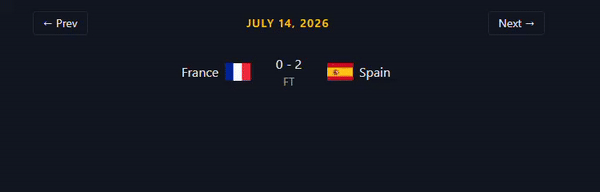

# World Cup Dashboard

A dashboard for browsing the 2026 FIFA World Cup fixtures, results, standings, and top scorers, built with Next.js. Data is pulled live from the [football-data.org](https://www.football-data.org/) API, so fixtures, scores, and standings update automatically as real matches are played.

**Live demo:** [world-cup-dashboard.vercel.app](https://world-cup-dashboard.vercel.app)



*A glance at the day-by-day navigation. See the [live demo](https://world-cup-dashboard.vercel.app) for the full app.*

## Features

- **Fixtures & results** — day-by-day navigation through matches, with handling of non-match days and post-tournament state
- **Group standings** — full table for all 12 groups showing position, record (W/D/L), goal difference, and points, responsive down to mobile
- **Top scorers** — leaderboard of the tournament's top 20 goalscorers
- **Knockout bracket** — visual bracket for the knockout stage, separate from the group stage
- **Error handling** — dedicated error states across all pages, with specific messaging for rate-limited responses

## Stack

- [Next.js](https://nextjs.org/) (App Router) + TypeScript
- Tailwind CSS
- [football-data.org](https://www.football-data.org/) API

## Architecture notes

- Data is fetched server-side in React Server Components (`app/*/page.tsx`), keeping the API key off the client and avoiding client-side loading spinners for page loads.
- Server-rendered pages fetch football-data.org through a typed wrapper (`lib/football-api.ts`). The home page shows today's matches and needs to update live as scores change without a page refresh, so it polls a Next.js API route (`app/api/matches`) from the client instead.
- Components are kept small and single-purpose (e.g. `MatchCard`, `StandingsTable`, `ScorersTable`, `KnockoutBracket`), with interactivity (like day navigation) isolated to client components only where needed.

## Getting Started

1. Clone the repo:

   ```bash
   git clone https://github.com/david-botha/world-cup-dashboard.git
   cd world-cup-dashboard
   ```

2. Install dependencies:

   ```bash
   npm install
   ```

3. Add your football-data.org API key to `.env.local`:

   ```
   FOOTBALL_DATA_API_KEY=your_key_here
   ```

   You can get a free key at [football-data.org](https://www.football-data.org/client/register).

4. Run the dev server:

   ```bash
   npm run dev
   ```

5. Open [http://localhost:3000](http://localhost:3000).
